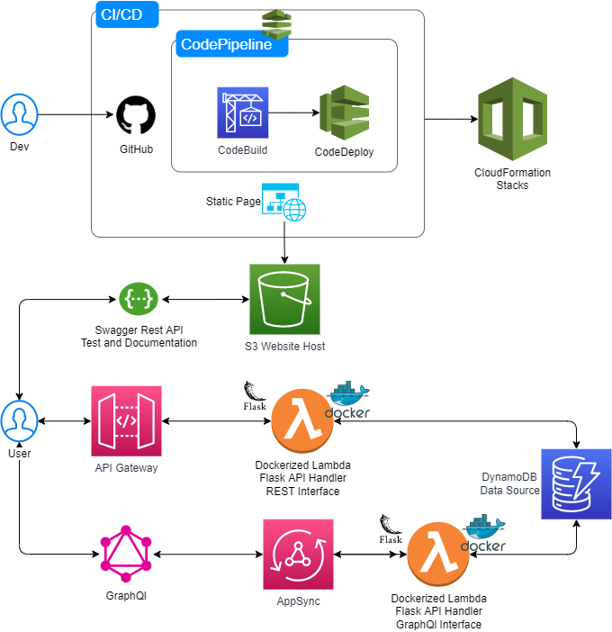

# Deepcell Evaluator - Challange

This project was developed inspired by the challenge proposed in the HackerRank platform. The purpose is to have a service capable of performing the same request, however, being served through a REST and GraphQl API.

The purpose of the application is to be able to receive two different strings as a REST request parameter, `sub` and `string`, or both also as elements for queries and mutation on GraphQl. The service aims to evaluate if the provided `string` is only build with repetition of the given `sub` string. If true, we must return the size of the smallest repeating sequence of the `sub`.
If false, you must return the `string` length as a negative value

Valid example:

```
sub = 'ABAB'
string = 'ABABABAB'
result = 2 (lenght of 'AB')
```

Invalid example:

```
sub = 'ABAB'
string = 'ABABABABC'
result = -9 (lenght of string)
```

So that the entire infrastructure used can be versioned and easily controlled by a CI/CD process, the AWS CDK was used in `python`.

The solution is served in a REST and GraphQl way so that an `evaluation` can be created, which always receives a `sub` and `string` to be evaluated.

The proposal to serve the application with both protocols, first is to present both alternatives, since only one could be chossen to provide the solution with excellence, and also to show a synchronous way with REST and asynchronous with GraphQl.

## Deepcell Evaluator - Serverless Infra

The developed solution has a CI/CD treadmill built with the help of GitHub and AWS Pipeline. All commits made to the `production` branch will automatically be pushed into production. It is also worth noting that the solution provided is 100% serverless, using services managed by AWS.

As mentioned before, the service is exposed through both interfaces, a REST API and another in GraphQl API. The computational environment chosen to run the Rest API was AWS Lambda, due to its simplicity and for being a managed service.

On the other hand, GraphQL is implemented using AWS AppSync, using also an Lambda and DynamoDB as Data Source. Both Lambdas have the same utility on this process, just being addapted to the correct environment.

When talking about the Rest API, the better way provided to test it and learn more about the API Contract, is taking looki at [Swagger Documentation](https://7n2tohdq9f.execute-api.us-east-1.amazonaws.com/prod/api/docs) develop for the running Flask API.




To configure the application locally, you must first ensure:

* Package `python` correctly installed locally
* Package `cdk` correctly installed locally
* Package `aws` (AWS CLI) correctly installed locally and profile already configured
* `docker`
  
Next, create a virtual environment named `.venv`.

```
$ python -m venv .venv
```

Activate the environment, if at Unix:

```
$ source .venv/bin/activate
```

Windows:

```
source.bat

or

% .venv\Scripts\activate.bat
```

After the environment is activated, install the necessary libs

```
(.venv)$ pip install -r requirements.txt
```

At this ,stage the cdk is already locally configured. The last step is to set the following context keys in the `cdk.json` file:

 * `namespace`
 * `domain_name`
 * `owner`
 * `repo`
 * `branch`

The final configuration step is to generate a `key` on GitHub, for the pipeline be capable to fecth the code from the repository, and store it as on AWS Secret Manager Service, with the name `github`. You can store you key as a raw plain text.

After performing all the settings it is possible to synthesize the template

```
$ cdk synth
```
Run the bootstrap generation process

```
$ cdk bootstrap
```
And finally, deploy to your configured AWS account

```
$ cdk deploy
```

## Useful commands

 * `cdk ls`          list all stacks in the app
 * `cdk synth`       emits the synthesized CloudFormation template
 * `cdk deploy`      deploy this stack to your default AWS account/region
 * `cdk diff`        compare deployed stack with current state
 * `cdk docs`        open CDK documentation

## Run the REST Flask API locally on docker

    cd ~/deepcell_evaluator/lambdas/rest_api
    docker build -t deepcell_rest_api .
    docker run -p 9000:5000 deepcell_rest_api

## Run the REST Flask API locally on Flask App

    cd ~/deepcell_evaluator/lambdas/rest_api
    python api.py

## Run the GraphQl Flask API locally on docker

    cd ~/deepcell_evaluator/lambdas/graphql_api
    docker build -t deepcell_graphql_api .
    docker run -p 9000:5000 deepcell_graphql_api

## Run the tests

    pytest

## Rest API

You can check and test the API documentation on 
[SWAGGER](https://7n2tohdq9f.execute-api.us-east-1.amazonaws.com/prod/api/docs/).

    
## GraphQl API

To check the full schema for the GraphQL API, with allthe Queries and Mutations, please check the file `schema.txt` on the directory `/deepcell-evaluator/deepcel_evaluator/files/graphql` .

  **Sample Create Request:**

        mutation CreateExample {
            createEvaluation(string: "DCDCDCDC", sub: "DCDC") {
                conditions
                id
                message
                result
                string
                sub
                timestamp
            }
        }
  ### Response

        {
            "data": {
                "createEvaluation": {
                "conditions": [],
                "id": "d078bc0b-a4d7-4c87-ae66-e97d9fd857a8",
                "message": "The smallest subset of substring dcdc is dc with length 2",
                "result": 2,
                "string": "DCDCDCDC",
                "sub": "DCDC",
                "timestamp": "2022-02-12T20:32:56.015Z"
                }
            }
        }

  **Sample Update Request:**
  
    mutation UpdateExample {
            updateEvaluation(id: "d078bc0b-a4d7-4c87-ae66-e97d9fd857a8", string: "DEEPCELLCELL", sub: "CELL") {
                conditions
                id
                message
                result
                string
                sub
                timestamp
            }
    }

  ### Response

    {
        "data": {
            "updateEvaluation": {
            "conditions": [
                "Provided String is not a unique sequence of provided Sub string"
            ],
            "id": "d078bc0b-a4d7-4c87-ae66-e97d9fd857a8",
            "message": "",
            "result": -12,
            "string": "DEEPCELLCELL",
            "sub": "CELL",
            "timestamp": "2022-02-12T20:41:40.441Z"
            }
        }
    }
  **Sample Delete Request:**
  
    mutation DeleteExample {
        deleteEvaluation(id: "d078bc0b-a4d7-4c87-ae66-e97d9fd857a8") {
            message
        }
    }


  ### Response

    {
        "data": {
            "id": "d078bc0b-a4d7-4c87-ae66-e97d9fd857a8",
            "message": ""
            }
        }
    }

**Sample Query Request:**

    query CheckExample {
        getEvaluation(id: "d078bc0b-a4d7-4c87-ae66-e97d9fd857a8") {
            conditions
            id
            message
            result
            string
            sub
            timestamp
        }
    }


  ### Response  
    {
        "data": {
            "getEvaluation": {
            "conditions": [],
            "id": "d078bc0b-a4d7-4c87-ae66-e97d9fd857a8",
            "message": "The smallest subset of substring dcdc is dc with length 2",
            "result": 2,
            "string": "DCDCDCDC",
            "sub": "DCDC",
            "timestamp": "2022-02-12T20:32:56.015Z"
            }
        }
    }